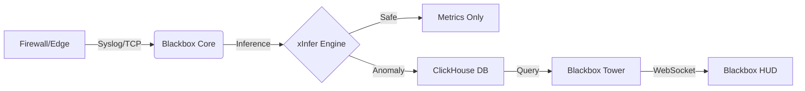

Here is a professional, high-impact `README.md` designed for your **Blackbox** monorepo. It leverages the "Flight Recorder" branding and highlights the technical superiority of your C++ stack.

You can copy and paste the raw markdown below directly into your GitHub repository.

***

# ◼️ Blackbox
> **The AI-Native Flight Recorder for Enterprise Security.**

[]()
[]()
[]()

**Blackbox** is a next-generation SIEM (Security Information and Event Management) engine built for speed, privacy, and active defense. Unlike traditional "store-then-analyze" systems, Blackbox sits inline with your network traffic, using a hyper-optimized C++ engine to detect and block threats in microseconds.

It is the indestructible record of truth for your network.

---

## ⚡ Key Features

*   **🚀 Kinetic Defense Engine:** Built in **C++ 20** with `Boost.Asio`. Handles 100,000+ Events Per Second (EPS) on commodity hardware with sub-millisecond latency.
*   **🧠 Inline AI Inference:** Proprietary `xInfer` technology runs custom-trained AI models directly in the data stream. No cloud APIs. No data leakage.
*   **📉 90% Storage Reduction:** Intelligent filtering discards "green" (safe) noise before it hits the disk, storing only the telemetry that matters.
*   **🛡️ Air-Gap Ready:** A fully self-contained containerized architecture. Deployable in high-security environments with zero internet connectivity.
*   **👁️ The HUD:** A **React/Vite** "heads-up display" for security analysts, featuring real-time visualization of network velocity and threat vectors.

---

## 🏗️ Architecture

Blackbox operates as a Monorepo containing the entire operational stack.



### 📂 Module Breakdown

| Directory | Codename | Tech Stack | Description |
| :--- | :--- | :--- | :--- |
| **`/blackbox-core`** | **The Recorder** | C++ 20, CUDA | The high-performance ingestion and inference gateway. It parses logs, runs AI, and routes data. |
| **`/blackbox-tower`** | **The Tower** | Go (Golang) | The API control plane. Manages authentication, DB queries, and real-time WebSocket streams. |
| **`/blackbox-hud`** | **The HUD** | React, TS, Vite | The analyst dashboard. Visualizes threat maps and log streams using virtualization. |
| **`/blackbox-sim`** | **The Sim** | Python, xTorch | The offline R&D lab. Trainings custom AI models on historical data to produce `.plan` engines. |
| **`/blackbox-deploy`** | **The Chassis** | Docker, K8s | Infrastructure as Code. Helm charts and ClickHouse optimization schemas. |

---

## 🛠️ Quick Start (Local Dev)

Prerequisites: `Docker` and `Docker Compose`.

1.  **Clone the Repository**
    ```bash
    git clone https://github.com/your-org/blackbox.git
    cd blackbox
    ```

2.  **Launch the Stack**
    We use a unified compose file to spin up the Core, API, Database (ClickHouse), and Dashboard.
    ```bash
    docker-compose up -d --build
    ```

3.  **Access the HUD**
    Open your browser and navigate to:
    *   **Dashboard:** `http://localhost:3000`
    *   **API Health:** `http://localhost:8080/health`
    *   **ClickHouse:** `http://localhost:8123`

4.  **Simulate Traffic**
    Send a test log to the Core (UDP Port 514):
    ```bash
    echo "<13>Dec 10 10:00:00 localhost test-service: login failed for user root" | nc -u -w1 127.0.0.1 514
    ```

---

## 💻 Tech Stack

*   **Ingestion:** C++ 20, Boost.Asio, SIMDJson, RingBuffers (Disruptor Pattern).
*   **AI/ML:** PyTorch (Training), TensorRT (Inference), CUDA.
*   **Storage:** ClickHouse (Logs), Redis (Pub/Sub & Caching).
*   **Backend:** Go (Gin Framework), gRPC.
*   **Frontend:** TypeScript, React, Zustand, TailwindCSS, Recharts.
*   **Infrastructure:** Kubernetes, Helm, Docker.

---

## 🛣️ Roadmap

- [x] **Phase I:** Core C++ Engine & ClickHouse Integration.
- [x] **Phase II:** Basic Anomaly Detection (Rule-based).
- [ ] **Phase III:** `xInfer` Integration for Inline AI Blocking.
- [ ] **Phase IV:** Enterprise SSO & RBAC (Role-Based Access Control).
- [ ] **Phase V:** "Blackbox Edge" (Hardware Appliance Support).

---

## 🤝 Contributing

Blackbox is currently a proprietary project with specific open-source components.
1.  Check the `Issues` tab for open tasks.
2.  Create a Feature Branch (`git checkout -b feat/new-parser`).
3.  Commit your changes.
4.  Open a Pull Request against `dev`.

---

## 📄 License

Copyright © 2025 **Ignition AI**. All Rights Reserved.
Not for public distribution without express written consent.